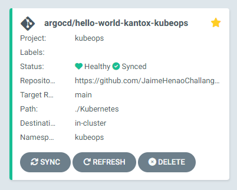
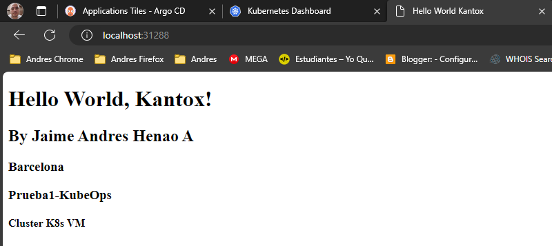

# Proyecto Hello World con Kubernetes, GitHub Actions y ArgoCD por Jaime Andres Henao


## Estructura del Proyecto:

```console
├── KubeOps
│   ├── .github
│   │   └── workflows
│   │       └── cd.yml
│   ├── Docker
│   │   ├── Dockerfile
│   │   ├── index.html
│   ├── Kubernetes
│   │   ├── deployment.yaml
│   │   ├── service.yaml
│   ├── .gitignore
│   └── README.md
└──
```

Este proyecto demuestra cómo desplegar una aplicación "Hello World" en un clúster de Minikube utilizando GitHub Actions para la implementación continua y ArgoCD para la entrega continua.


## Guia de ArgoCD en Kubernetes (minikube) con GitHub Actions

Instalación con Helm Chart y gestion desde CLI

**Requisitos previos:**

* Instalamos el binario de Helm https://helm.sh/docs/intro/install/

* Instalamos Minikube https://minikube.sigs.k8s.io/docs/start/

* Instalamos el Binario de ArgoCD https://argo-cd.readthedocs.io/en/stable/cli_installation/

**Guia**

1.	Iniciamos nuestro Minikube para contar con un Clúster de K8s en local

    minikube start

2.	Añadimos el repo de Helm

    helm repo add argo https://argoproj.github.io/argo-helm

3.	Hacemos pull del Chart para descargarlo, poder ver el contenido del Chart e instalarlo.

    helm pull argo/argo-cd --version 5.8.2

4.	Descomprimimos el paquete TGZ del Chart descargado

    tar -zxvf argo-cd-5.8.2.tgz

5.	Hacemos la instalación pasando parámetros de configuración

    helm install argo-cd argo-cd/ \
    --namespace argocd \
    --create-namespace --wait \
    --set configs.credentialTemplates.github.url=https://github.com/JaimeHenaoChallange/KubeOps.git \
    --set configs.credentialTemplates.github.username=$(cat ~/.secrets/github/JaimeHenaoChallange/user) \
    --set configs.credentialTemplates.github.password=$(cat ~/.secrets/github/JaimeHenaoChallange/token)


6.	Imprimimos en pantalla la contraseña del usuario "admin" por defecto que se ha generado automáticamente en la instalación

    kubectl -n argocd get secret argocd-initial-admin-secret -o jsonpath="{.data.password}" | base64 -d; echo

7.	Levantamos un Port-Forward para poder acceder a ArgoCD UI desde localhost:8080

    kubectl port-forward --address 0.0.0.0 service/argo-cd-argocd-server -n argocd 8080:443

8.	Hacemos login en ArgoCD con la contraseña que hemos obtenido

    argocd login localhost:8080

9.	Una vez que hemos hecho login satisfactoriamente cambiamos la contraseña generada por una que nos venga mejor, como por ejemplo "passwd1234"

    argocd account update-password

10.	Ahora que estamos logados con el binario de argocd podemos agregar el repositorio de código.

    argocd repo add https://github.com/JaimeHenaoChallange/KubeOps.git


11.	Creamos un proyecto de pruebas para kantox en el que solo se puedan crear aplicaciones en el namespace "kantox" y con determinado repositorio de código

    argocd proj create kubeops -d https://kubernetes.default.svc,kubeops -s https://github.com/JaimeHenaoChallange/KubeOps.git

12.	Creamos el Namespace "kantox" que será el que usaremos para desplegar las aplicaciones

    kubectl create ns kubeops

13.	Ahora creamos nuestra primera aplicación de pruebas en el proyecto que hemos creado anteriormente

    argocd app create hello-world-kantox-kubeops \
    --repo https://github.com/JaimeHenaoChallange/KubeOps.git \
    --revision main --path ./Kubernetes  \
    --dest-server https://kubernetes.default.svc \
    --dest-namespace kubeops \
    --sync-policy automated \
    --project kubeops


14.	Esperamos que sincronice la app de argocd:

    

15.	Verificamos el svc de la app creada para ver le puerto (kubectl get svc -n kubeops):

    

16.	Realizamos un port-forward para verificar que la app se ve bien:

    

    


Jaime A. Henao
Cloud Enginer.